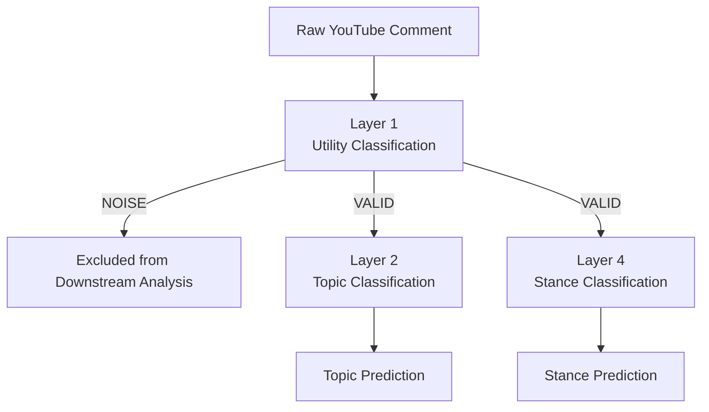
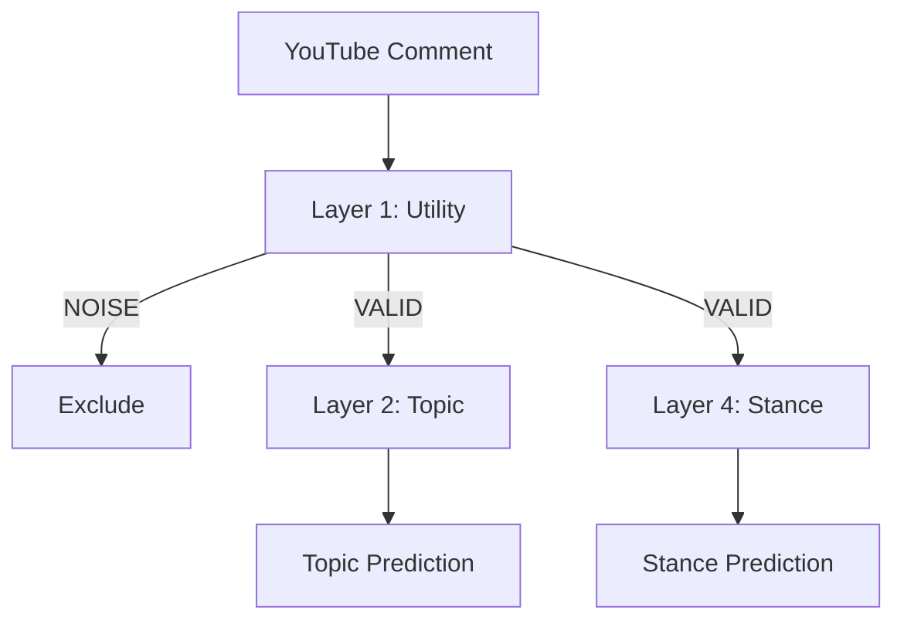

# Public Pulse — Fine-Tuned Models

> **Fine-tuned multilingual NLP models for the Public Pulse civic intelligence platform**

This directory documents the fine-tuned machine learning models used by **Public Pulse — Civic Intelligence for Sri Lankan Public Discourse**.

Public Pulse uses a cascaded NLP architecture based on **XLM-RoBERTa (`xlm-roberta-base`)** to analyze public discourse collected from Sri Lankan TV news YouTube comments.

The fine-tuned model weights are intentionally **not stored in this GitHub repository** because the checkpoint files are large. The trained model artifacts are maintained separately in the project's Google Drive repository.

---

## Table of Contents

- [Overview](#overview)
- [Model Architecture](#model-architecture)
- [Model Inventory](#model-inventory)
- [Layer 1 — Utility Classification](#layer-1--utility-classification)
- [Layer 2 — Topic Classification](#layer-2--topic-classification)
- [Layer 4 — Stance Classification](#layer-4--stance-classification)
- [Model Storage](#model-storage)
- [Fine-Tuned Model Repository](#fine-tuned-model-repository)
- [Downloading the Models](#downloading-the-models)
- [Installing the Models](#installing-the-models)
- [Expected Directory Structure](#expected-directory-structure)
- [Verifying the Installation](#verifying-the-installation)
- [Inference Pipeline](#inference-pipeline)
- [Layer 3 — Important Note](#layer-3--important-note)
- [Retraining](#retraining)
- [Reproducibility](#reproducibility)
- [Model Versioning](#model-versioning)
- [Security and Privacy](#security-and-privacy)
- [Git Repository Policy](#git-repository-policy)
- [Troubleshooting](#troubleshooting)
- [New Team Member Setup](#new-team-member-setup)
- [Quick Setup Checklist](#quick-setup-checklist)
- [Project Information](#project-information)
- [Maintainers](#maintainers)

---

## Overview

Public Pulse is a civic intelligence platform designed to analyze public discourse from Sri Lankan TV news programs on YouTube.

The project processes real-world user-generated comments that may contain:

- Sinhala
- Singlish
- English
- Tamil
- Code-switched text
- Informal language
- Spelling variations
- Noisy content
- Irrelevant comments

The classification component uses fine-tuned **XLM-RoBERTa** models to progressively process collected comments.

The current classification pipeline consists of:

```text
Layer 1 → Utility Classification
Layer 2 → Topic Classification
Layer 4 → Stance Classification
```

The models operate as a cascade. Layer 2 and Layer 4 are applied only to comments that pass the Layer 1 utility filter.

---

## Model Architecture

Public Pulse uses a cascaded multilingual NLP classification architecture.



### Processing Flow

#### 1. Layer 1 — Utility Classification

The first model determines whether the comment is useful for downstream analysis.

Possible outputs:

- `VALID`
- `NOISE`

Comments classified as `NOISE` are excluded from downstream classification.

#### 2. Layer 2 — Topic Classification

Only `VALID` comments are passed to the topic classifier.

The model assigns the comment to one of the five defined Public Pulse topic categories.

#### 3. Layer 4 — Stance Classification

Only `VALID` comments are passed to the stance classifier.

The model identifies whether the comment expresses a:

- Critical stance
- Neutral stance
- Supportive stance

---

## Model Inventory

| Layer | Model | Purpose | Base Model | Input | Task | Macro F1 |
|---|---|---|---|---|---|---:|
| Layer 1 | Utility | Filter usable comments | `xlm-roberta-base` | `text_raw` | Binary Classification | **0.9912** |
| Layer 2 | Topic | Classify discussion domain | `xlm-roberta-base` | `text_clean` | Multiclass Classification | **0.7050** |
| Layer 4 | Stance | Identify public stance | `xlm-roberta-base` | `text_clean` | Multiclass Classification | **0.8649** |

> The metrics above represent the evaluation results associated with the current fine-tuned model versions.

---

# Layer 1 — Utility Classification

## Purpose

Layer 1 determines whether a collected YouTube comment contains usable information for downstream analysis.

### Model Details

| Property | Value |
|---|---|
| Base Model | `xlm-roberta-base` |
| Input | `text_raw` |
| Task | Binary Classification |
| Output | `VALID`, `NOISE` |
| Macro F1 | **0.9912** |

### Labels

```text
VALID
NOISE
```

### Expected Model Location

```text
models/
└── layer1_utility/
    └── best_model/
```

The `best_model` directory contains the fine-tuned checkpoint and the associated configuration and tokenizer files required for inference.

---

# Layer 2 — Topic Classification

## Purpose

Layer 2 classifies valid comments into the defined Public Pulse discussion domains.

### Model Details

| Property | Value |
|---|---|
| Base Model | `xlm-roberta-base` |
| Input | `text_clean` |
| Task | Multiclass Classification |
| Number of Classes | 5 |
| Macro F1 | **0.7050** |

### Labels

```text
TOPIC_ECON_SERV
TOPIC_GOV
TOPIC_LAW
TOPIC_FOR
TOPIC_MEDIA
```

### Expected Model Location

```text
models/
└── layer2_topic/
    └── best_model/
```

---

# Layer 4 — Stance Classification

## Purpose

Layer 4 identifies the stance expressed in a valid comment.

### Model Details

| Property | Value |
|---|---|
| Base Model | `xlm-roberta-base` |
| Input | `text_clean` |
| Task | Multiclass Classification |
| Number of Classes | 3 |
| Macro F1 | **0.8649** |

### Labels

| Label | Meaning |
|---|---|
| `STANCE_CRIT` | Critical |
| `STANCE_NEUT` | Neutral |
| `STANCE_SUPP` | Supportive |

### Expected Model Location

```text
models/
└── layer4_stance/
    └── best_model/
```

---

# Model Storage

The fine-tuned model weights are intentionally **not committed to the GitHub repository**.

This is a deliberate project decision because the trained XLM-RoBERTa checkpoint files are large and would significantly increase repository size.

The project separates lightweight source and metadata from large binary model artifacts.

### GitHub Repository

The GitHub repository contains:

- Model configuration
- Model metadata
- Label mappings
- Inference code
- Training-related documentation
- Tests
- Project source code

### Google Drive

The Google Drive repository contains the large fine-tuned model artifacts required for inference.

```text
Public Pulse
│
├── GitHub
│   ├── Source Code
│   ├── Configuration
│   ├── Model Metadata
│   ├── Label Mappings
│   └── Documentation
│
└── Google Drive
    └── Fine-Tuned Model Artifacts
        ├── Layer 1 — Utility
        ├── Layer 2 — Topic
        └── Layer 4 — Stance
```

This approach keeps the source repository lightweight while allowing authorized team members to restore the complete model environment when required.

---

# Fine-Tuned Model Repository

The current fine-tuned model artifacts are maintained in the project's Google Drive folder.

## Google Drive

**Public Pulse — Fine-Tuned Models**

**[Open the Public Pulse Fine-Tuned Models Google Drive Folder](https://drive.google.com/drive/folders/1YNec4OYy-b27rKG6YzdNU9Jbmx1Tk9Sm?usp=drive_link)**

The Google Drive folder is the external distribution location for the large fine-tuned model checkpoints.

> Access to the Google Drive folder may require permission from the project owner.

---

# Downloading the Models

Before running the Public Pulse inference pipeline on a new machine, download the required fine-tuned model artifacts from the project Google Drive folder.

### Required Models

The current Public Pulse classification system requires:

```text
Layer 1 — Utility Classification
Layer 2 — Topic Classification
Layer 4 — Stance Classification
```

### Download Location

Use the following Google Drive folder:

**[Public Pulse — Fine-Tuned Models](https://drive.google.com/drive/folders/1YNec4OYy-b27rKG6YzdNU9Jbmx1Tk9Sm?usp=drive_link)**

Download the model directories required by the current project structure.

---

# Installing the Models

## Step 1 — Clone the Repository

Clone the Public Pulse repository:

```bash
git clone https://github.com/ThilaniDilmani/public-pulse-srilanka.git
cd public-pulse-srilanka
```

---

## Step 2 — Download the Fine-Tuned Models

Open the project Google Drive folder:

**[Public Pulse — Fine-Tuned Models](https://drive.google.com/drive/folders/1YNec4OYy-b27rKG6YzdNU9Jbmx1Tk9Sm?usp=drive_link)**

Download the required model artifacts.

---

## Step 3 — Locate the Project Models Directory

The repository already contains the following directory:

```text
public-pulse-srilanka/
└── models/
```

The fine-tuned model directories should be placed directly inside this directory.

---

## Step 4 — Replace or Restore the Model Directories

If the downloaded folder contains:

```text
layer1_utility/
layer2_topic/
layer4_stance/
```

copy these directories into:

```text
public-pulse-srilanka/models/
```

The final structure should be:

```text
public-pulse-srilanka/
└── models/
    ├── layer1_utility/
    ├── layer2_topic/
    └── layer4_stance/
```

If the project already contains placeholder directories, replace the corresponding model directories with the downloaded fine-tuned model directories.

---

# Expected Directory Structure

After restoring the fine-tuned models, the directory should resemble the following:

```text
models/
│
├── README.md
│
├── layer1_utility/
│   ├── best_model/
│   │   ├── config.json
│   │   ├── model.safetensors
│   │   ├── tokenizer_config.json
│   │   ├── tokenizer.json
│   │   ├── sentencepiece.bpe.model
│   │   └── ...
│   │
│   ├── label_map.json
│   └── training_metadata.json
│
├── layer2_topic/
│   ├── best_model/
│   │   ├── config.json
│   │   ├── model.safetensors
│   │   ├── tokenizer_config.json
│   │   ├── tokenizer.json
│   │   ├── sentencepiece.bpe.model
│   │   └── ...
│   │
│   ├── label_map.json
│   └── training_metadata.json
│
└── layer4_stance/
    ├── best_model/
    │   ├── config.json
    │   ├── model.safetensors
    │   ├── tokenizer_config.json
    │   ├── tokenizer.json
    │   ├── sentencepiece.bpe.model
    │   └── ...
    │
    ├── label_map.json
    └── training_metadata.json
```

The exact files inside each `best_model` directory may vary depending on the model serialization format and the Transformers version used when the checkpoint was created.

---

# Correct Folder Placement

The fine-tuned model directories must be placed **directly under `models/`**.

### Correct

```text
models/
├── layer1_utility/
├── layer2_topic/
└── layer4_stance/
```

### Incorrect

```text
models/
└── models/
    ├── layer1_utility/
    ├── layer2_topic/
    └── layer4_stance/
```

Avoid creating an unnecessary nested `models/models/` directory.

---

# Verifying the Installation

After downloading and copying the models, verify that all three model directories exist.

## Windows

From the project root:

```cmd
dir models\layer1_utility
dir models\layer2_topic
dir models\layer4_stance
```

Then verify the checkpoint directories:

```cmd
dir models\layer1_utility\best_model
dir models\layer2_topic\best_model
dir models\layer4_stance\best_model
```

---

## Linux / macOS

From the project root:

```bash
ls -la models/layer1_utility
ls -la models/layer2_topic
ls -la models/layer4_stance
```

Then:

```bash
ls -la models/layer1_utility/best_model
ls -la models/layer2_topic/best_model
ls -la models/layer4_stance/best_model
```

---

# Model Loading Verification

Before running a complete analysis pipeline, verify that all three fine-tuned models can be loaded successfully.

The expected result is:

```text
Layer 1 model: loaded successfully
Layer 2 model: loaded successfully
Layer 4 model: loaded successfully
```

If the project provides a dedicated model verification test, use that test as the primary verification method.

A project inference command may be used where appropriate, for example:

```bash
python -m public_pulse.pipeline.service
```

Use the current project entry point if it differs from the example above.

---

# Inference Pipeline

The models operate as a controlled cascade.



### Processing Logic

1. Receive the raw YouTube comment.
2. Apply Layer 1 utility classification.
3. If the result is `NOISE`, exclude the comment from downstream classification.
4. If the result is `VALID`, continue processing.
5. Apply Layer 2 topic classification.
6. Apply Layer 4 stance classification.
7. Store the resulting predictions.
8. Use the predictions for downstream analytics and grounded insights.

---

# Layer 3 — Important Note

There is **no Layer 3 model** in the current Public Pulse architecture.

This is intentional.

The current classification architecture is:

```text
Layer 1 → Utility
Layer 2 → Topic
Layer 4 → Stance
```

Therefore, the required classification models are:

```text
Layer 1
Layer 2
Layer 4
```

> **Do not create, download, train, or integrate a Layer 3 model unless the research architecture is formally changed and the change is documented.**

---

# Retraining

The models stored in the Google Drive repository are existing fine-tuned checkpoints.

A developer does **not** need to retrain these models simply to run Public Pulse.

The normal setup process is:

```text
Download Model Artifacts
        ↓
Place Models in models/
        ↓
Verify Files
        ↓
Load Models
        ↓
Run Inference
```

Retraining should only be performed as part of a formally documented model development experiment or model update.

If a new model is trained, its dataset, configuration, evaluation results, and version should be documented before replacing the current production/research checkpoint.

---

# Reproducibility

Public Pulse is a research-oriented system. Model reproducibility is therefore an important requirement.

Each model release should, where applicable, document:

- Base model
- Fine-tuned model version
- Training dataset version
- Dataset split
- Preprocessing version
- Label mapping
- Training configuration
- Evaluation metrics
- Python version
- PyTorch version
- Transformers version
- Tokenizer version
- Training date
- Model checksum or hash where available

The exact model artifact used to generate research results should be identifiable.

---

# Model Versioning

Fine-tuned models should be treated as versioned research artifacts.

When a model is replaced or retrained, the previous model should not be silently overwritten.

Each model version should identify information such as:

```text
Model Version
Base Model
Task
Dataset Version
Labels
Evaluation Metrics
Training Environment
Training Date
```

For example:

```json
{
  "model_version": "v1.0",
  "base_model": "xlm-roberta-base",
  "task": "stance_classification",
  "macro_f1": 0.8649
}
```

When a new model is introduced:

1. Assign a new model version.
2. Preserve the evaluation results.
3. Update the relevant metadata.
4. Document the dataset and preprocessing version.
5. Document the software environment.
6. Update this README if the architecture changes.

---

# Security and Privacy

The `models/` directory must never contain secrets or sensitive credentials.

Do not store:

```text
.env
API keys
Database passwords
Access tokens
Private credentials
Service-account keys
Private user information
```

Secrets must be supplied through environment variables or an approved secret management mechanism.

Model artifacts should also be checked before distribution to ensure that they do not contain unintended sensitive information.

---

# Git Repository Policy

Large fine-tuned model weights are intentionally excluded from the normal Git workflow.

The GitHub repository should contain lightweight project artifacts such as:

```text
✓ Model configuration
✓ Model metadata
✓ Label mappings
✓ Documentation
✓ Inference code
✓ Tests
```

Large binary checkpoint files should remain in the approved external model storage location.

Do **not** force-add large model checkpoint files to Git simply to make them available to other developers.

If the project later requires formal version control for large model artifacts, an appropriate artifact-management solution such as Git LFS or a dedicated model registry should be evaluated.

---

# Troubleshooting

## Model Not Found

If the application reports:

```text
FileNotFoundError
ModelNotFoundError
```

verify that the required directories exist:

```text
models/
├── layer1_utility/
├── layer2_topic/
└── layer4_stance/
```

---

## Incorrect Nested Directory

If the downloaded models are located at:

```text
models/models/layer1_utility/
```

move them so that the correct structure is:

```text
models/layer1_utility/
```

The same rule applies to Layer 2 and Layer 4.

---

## Missing Model Files

If a model directory exists but loading fails, verify that the complete model artifact was downloaded.

Important files may include:

```text
config.json
model.safetensors
tokenizer_config.json
tokenizer.json
sentencepiece.bpe.model
```

The exact required files depend on how the checkpoint was saved.

---

## Tokenizer Error

If the tokenizer cannot be loaded:

1. Confirm that the tokenizer files were downloaded.
2. Confirm that the tokenizer belongs to the same checkpoint.
3. Do not mix tokenizer files from different model versions.
4. Verify the installed Transformers version.

---

## Model Loading Error

If the model files exist but the model cannot be loaded, verify:

1. Python environment
2. PyTorch installation
3. Transformers version
4. Tokenizer version
5. Model directory path
6. Model configuration
7. Checkpoint completeness
8. Model version compatibility

Do not immediately retrain the model.

---

## Incorrect Predictions

If predictions appear incorrect, first verify the complete inference chain:

```text
Checkpoint
    ↓
Tokenizer
    ↓
Preprocessing
    ↓
Label Mapping
    ↓
Inference Code
```

All components must correspond to the same model version.

---

# New Team Member Setup

A new developer or researcher should follow this process:

### 1. Clone the Repository

```bash
git clone https://github.com/ThilaniDilmani/public-pulse-srilanka.git
cd public-pulse-srilanka
```

### 2. Set Up the Project Environment

Follow the main project's environment and dependency setup instructions.

### 3. Download the Fine-Tuned Models

Open:

**[Public Pulse — Fine-Tuned Models Google Drive](https://drive.google.com/drive/folders/1YNec4OYy-b27rKG6YzdNU9Jbmx1Tk9Sm?usp=drive_link)**

### 4. Restore the Model Directories

Place:

```text
layer1_utility/
layer2_topic/
layer4_stance/
```

directly under:

```text
models/
```

### 5. Verify the Directory Structure

Confirm:

```text
models/
├── layer1_utility/
├── layer2_topic/
└── layer4_stance/
```

### 6. Verify the Model Files

Confirm that each `best_model` directory contains the required checkpoint and tokenizer files.

### 7. Run Model Verification

Confirm that Layer 1, Layer 2, and Layer 4 load successfully.

### 8. Run the Public Pulse Pipeline

Once model loading is successful, the models are ready for inference.

---

# Quick Setup Checklist

Before running the Public Pulse inference pipeline, confirm:

- [ ] Public Pulse repository cloned successfully
- [ ] Python environment configured
- [ ] Required dependencies installed
- [ ] Fine-tuned models downloaded from Google Drive
- [ ] `layer1_utility` placed under `models/`
- [ ] `layer2_topic` placed under `models/`
- [ ] `layer4_stance` placed under `models/`
- [ ] No unnecessary `models/models/` nesting exists
- [ ] `best_model` directory exists for Layer 1
- [ ] `best_model` directory exists for Layer 2
- [ ] `best_model` directory exists for Layer 4
- [ ] Model configuration files are present
- [ ] Model weight files are present
- [ ] Tokenizer files are present
- [ ] Label mappings are present
- [ ] Model loading test passes
- [ ] Layer 1 loads successfully
- [ ] Layer 2 loads successfully
- [ ] Layer 4 loads successfully
- [ ] No Layer 3 model is expected
- [ ] No API keys or credentials are stored in the model directory

---

# Project Information

## Project Name

**Public Pulse**

### Description

**Public Pulse — Civic Intelligence for Sri Lankan Public Discourse**

Public Pulse is a research-oriented civic intelligence platform designed to analyze public discourse from Sri Lankan TV news programs on YouTube.

The system combines:

- YouTube public discourse data collection
- Data cleaning and preprocessing
- Multilingual NLP
- XLM-RoBERTa classification
- Topic analysis
- Stance analysis
- Evidence retrieval
- Retrieval-Augmented Generation (RAG)
- Grounded LLM generation
- Faithfulness verification
- Interactive analytics

The fine-tuned XLM-RoBERTa models documented in this directory form the classification component of the system.

---

# Fine-Tuned Model Source

The large fine-tuned model artifacts are maintained separately from the GitHub source repository.

### Google Drive

**[Public Pulse — Fine-Tuned Models](https://drive.google.com/drive/folders/1YNec4OYy-b27rKG6YzdNU9Jbmx1Tk9Sm?usp=drive_link)**

Use this folder to restore the fine-tuned model checkpoints when setting up the project on a new machine.

---

# Current Classification Layers

```text
Layer 1 — Utility Classification
Layer 2 — Topic Classification
Layer 4 — Stance Classification
```

---

# Maintainers

**Public Pulse Research Team**

This documentation should be updated whenever:

- A model is replaced
- A model version changes
- Labels are modified
- The preprocessing pipeline changes
- Model performance is updated
- The model storage location changes
- The classification architecture changes

---

## License

Refer to the root project's license and repository documentation for the applicable licensing terms.

---

**Document:** `models/README.md`  
**Purpose:** Fine-tuned model documentation, distribution, and restoration  
**Model Family:** XLM-RoBERTa  
**Model Storage:** Project Google Drive  
**Source Repository:** Public Pulse GitHub Repository  
**Classification Architecture:** Layer 1 → Layer 2 + Layer 4
